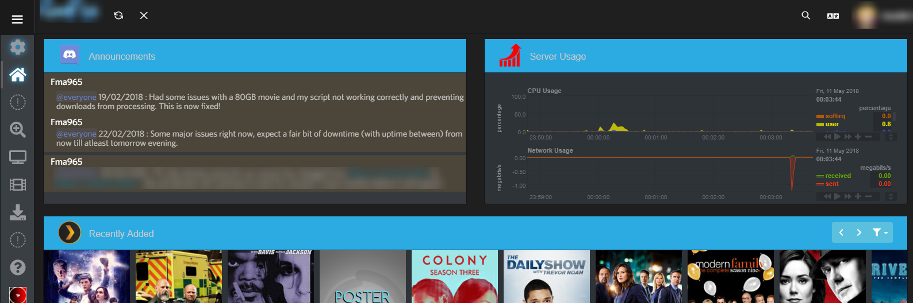
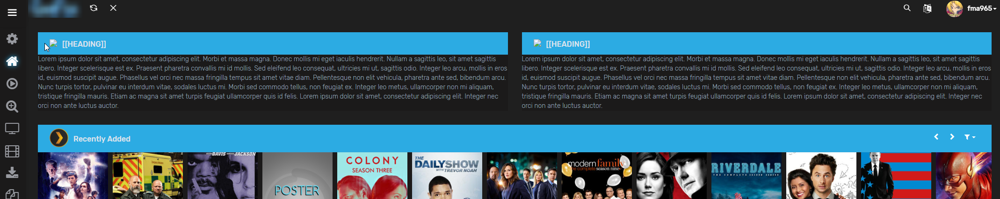

# Homepage

## Headers for each element

```css
.fc-toolbar,.bg-info {
    background-color: red !important;
}
```

## Discord/Netdata 2 Column Layout Exammple

```css
.overflowhider {
	height: 228px;
	overflow: hidden;
}
/* used to hide server usage on mobile devices */
@media only screen and (max-width: 800px) {
    #netdatacustom {
        display:none;
    }
}

#discordwidget {
    left: -15px;
    position: relative;
    height: calc(200px + 260px);
    width: calc(100% + 20px);
    top: -100px;
}
```

```html
<div id="customHTML" class="row">
<div class="col-lg-6">
	<div class="panel panel-default">		
		<div class="panel-heading bg-info p-t-10 p-b-10">
			<span class="pull-left m-t-5"> &nbsp; <span lang="en">Announcements</span></span>
			<div class="clearfix"></div>
		</div>
	<div class="overflowhider"><embed id="discordwidget" src='WIDGETBOT IO EMBED URL'/></div>
	</div>
</div><div class="col-lg-6">
	<div class="panel panel-default">		
		<div class="panel-heading bg-info p-t-10 p-b-10">
			<span class="pull-left m-t-5"> &nbsp; <span lang="en">Server Usage</span></span>
			<div class="clearfix"></div>
		</div>
	<div class="overflowhider"><embed id="netdatawidget" src='/customnetdata/custom.html'/></div>
	</div>
</div></div>
```
for more info on the netdata custom html see here https://technicalramblings.com/blog/spice-up-your-homepage/

## Generic 2 Column Layout Example

Replace [[IMAGEURL]], [[HEADING]] and [[CONTENT]] with your content
```html
<div id="customHTML" class="row">
<div class="col-lg-6">
	<div class="panel panel-default">
		<div class="panel-heading bg-info p-t-10 p-b-10">
			<span class="pull-left m-t-5">
				 &nbsp; <span lang="en">[[HEADING]]</span>
			</span>
			<div class="clearfix"></div>
		</div>
		[[CONTENT]]
	</div>
</div>
<div class="col-lg-6">
	<div class="panel panel-default">
		<div class="panel-heading bg-info p-t-10 p-b-10">
			<span class="pull-left m-t-5">
				 &nbsp; <span lang="en">[[HEADING]]</span>
			</span>
			<div class="clearfix"></div>
		</div>
		[[CONTENT]]
	</div>
</div>
</div>
```

# Default colors

## Style: Dark
Navbar: `#1f1f1f`  
Sidebar: `#1b1a1a`  
Accent Color: `#2cabe3` Headers/settingicons  
Button Color: `#2cabe3`  
Text: `#fffff`  
