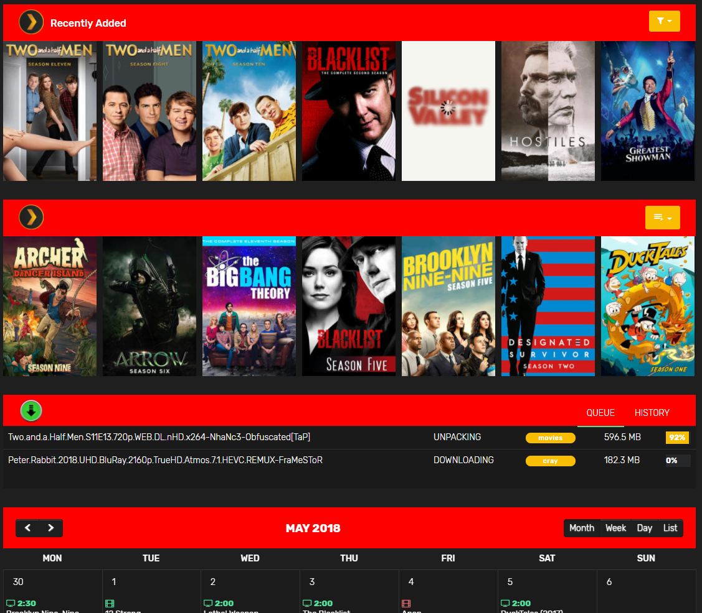

# Homepage

## Headers for each element

```css
.fc-toolbar,.bg-info {
    background-color: red !important;
}
```

# Default colors

## Style: Dark
Navbar: `#1f1f1f`  
Sidebar: `#1b1a1a`  
Accent Color: `#2cabe3` Headers/settingicons  
Button Color: `#2cabe3`  
Text: `#fffff`  